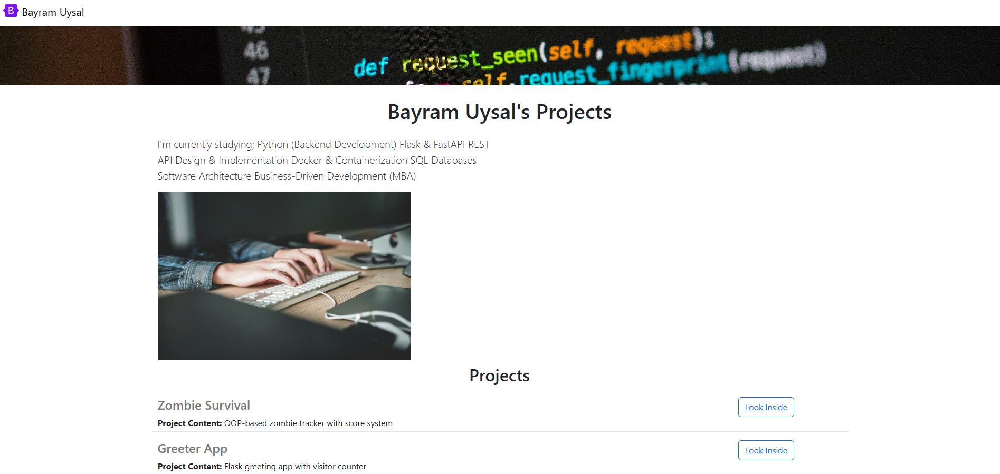

# Bayram Uysal's Personal Website

[](LICENSE)

This website showcases my projects and skills. You can view it live at [https://personal-website-framed-with-flask-v2.onrender.com/](https://personal-website-framed-with-flask-v2.onrender.com/).



## ✨ Projects

This website is built with Flask and includes the following features:

* **Project Showcase:** Displays a list of my projects, including their names, descriptions, links, and the languages used.
* **Contact Form:** A form where visitors can send me questions or messages.

## 🛠 Built With

* Python/Flask
* HTML/CSS
* Bootstrap

## 🚀 Run Locally

1. Make sure you have Python installed.
2. Clone the repository: 

```bash 
git clone https://github.com/BayramUysalBey/personal-website-framed-with-flask-v2.git 
```
3. Navigate to the project directory: 

```bash 
cd personal-website-framed-with-flask-v2 
```
4. Create a virtual environment: 

```bash 
python -m venv venv 
```
5. Activate the virtual environment: 

* On Windows: 

```bash 
venv\Scripts\activate 
``` 
* On macOS and Linux: 

```bash 
source venv/bin/activate 
```
6. Install the Dependencies:

```bash
pip install -r requirements.txt
```
7. Run the Flask app:

```bash
flask run
```

## Contributing

Contributions are welcome! If you'd like to contribute, please fork the repository and submit a pull request.
